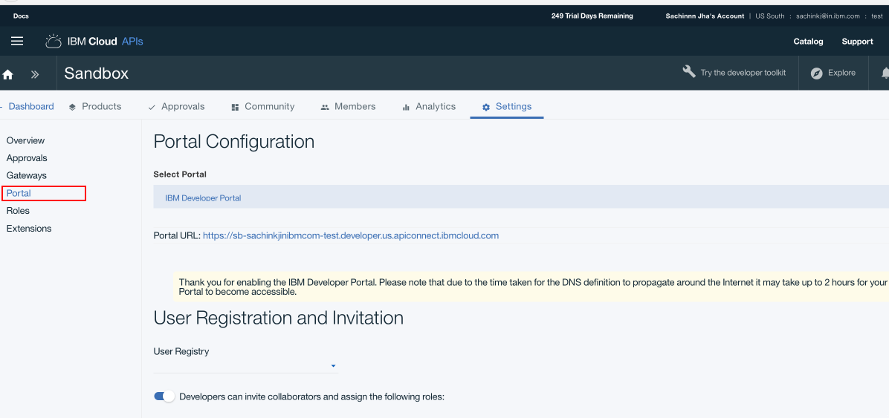

# The Hotels Microservices journey

This a micro services example the team is developing.

# Steps to be followed:
1. Login to IBM Cloud , choose a space and create an instance of "API Connect"
2. Create Developer portal in API Connect 
    * Go to the Dashboard and select the instance of API Connect create above. 
    * Go to the API Connect Dashboard and click on the "Settings" tab.
    * Under settings click on the "Portal" link in left navigation. 
    * Select the "IBM Developer portal" option under Portal. See image below
    
 

## Choose any of the options below to deploy microservices as Cloudfoundary apps or a mix of Kubernetes containers and Cloudfoundary.

### Deploy Hotels Microservices as Cloudfoundary apps on Bluemix
* [Deploy your own Hotels Microservices with IBM DevOps Toolchain](TOOLCHAIN-README.md)

> 

hotels-event-create pipeline and hotels-onboarding-ui pipeline require API\_KEY  and API\_SECRET in order to make the API calls to generate events for onboarding of hotels. These values can be obtained by registering as a consumer in API Connect developer portal and subscribing to the Events API. 

Once the API\_KEY  and API\_SECRET values are obtained, one should update the configuration parameters in Deploy Stages of these pipelines and restart them. This will successfully deploy the openwhisk actions and onboarding-ui application.

### Deploy Hotels Microservices as containers in Kubernetes Cluster on Bluemix
> 
